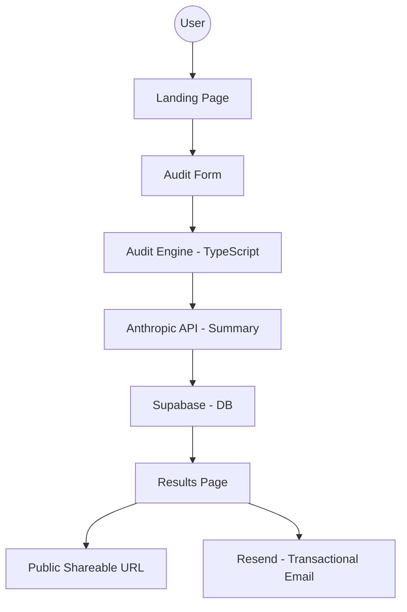

# Architecture — Lumina Audit

## System Diagram (Mermaid)

## Data Flow
1. **Input Capture**: User enters their AI stack details in a multi-step React form.
2. **Persistence**: Form state is persisted to `localStorage` for continuity.
3. **Audit Execution**: A deterministic TypeScript engine calculates potential savings based on `PRICING_DATA.md`.
4. **AI Summary**: The system calls a Next.js Server Action which interacts with the Anthropic API to generate a qualitative breakdown.
5. **Serialization**: The audit result is saved to Supabase with a unique ID. PII is stored separately or stripped for the public view.
6. **Viral Loop**: A shareable URL is generated with dynamic OG tags for social sharing.

## Tech Stack Choice
- **Next.js 15 (App Router)**: For server-side rendering of OG tags and high-performance page loads.
- **TypeScript**: Essential for maintaining the audit engine's logic integrity.
- **Tailwind CSS**: For rapid, premium UI development.
- **Supabase**: Handles the backend without the overhead of managing a custom server.
- **Resend**: Modern API for transactional emails.

## Scaling to 10k Audits/Day
If this were to scale to 10k audits/day:
1. **Rate Limiting**: Implement Upstash or Redis-based rate limiting on the Audit and Email endpoints.
2. **Caching**: Cache pricing data at the edge.
3. **Queueing**: Move email sending and AI summary generation to a background worker (e.g., Inngest or BullMQ) to reduce latency.
4. **Read Replicas**: If query volume for public URLs becomes a bottleneck, use read replicas for the database.
